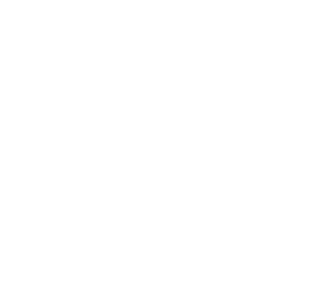
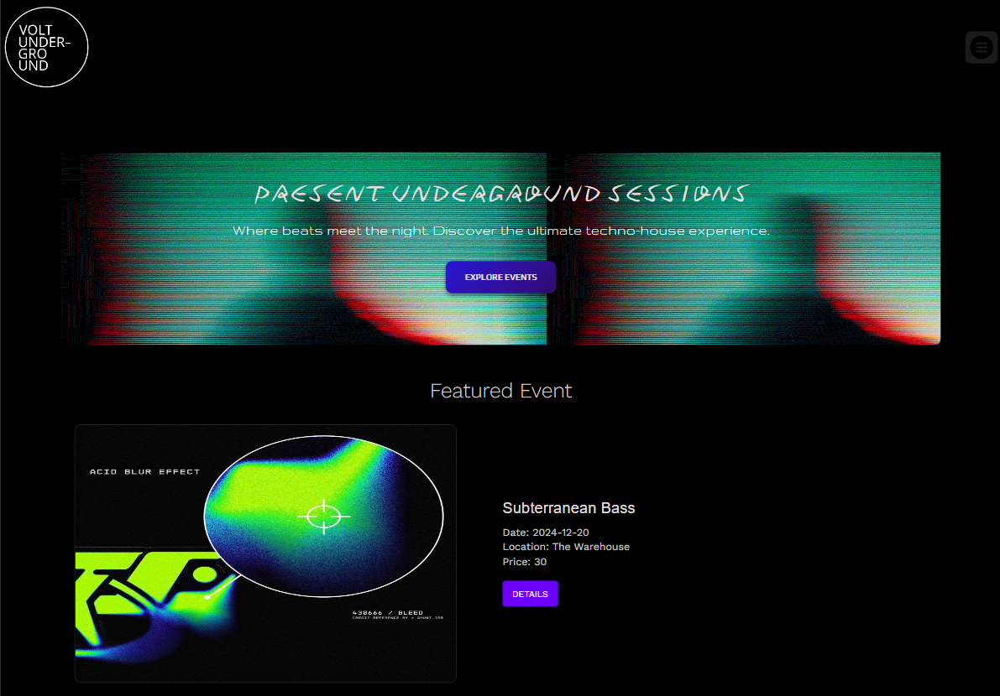
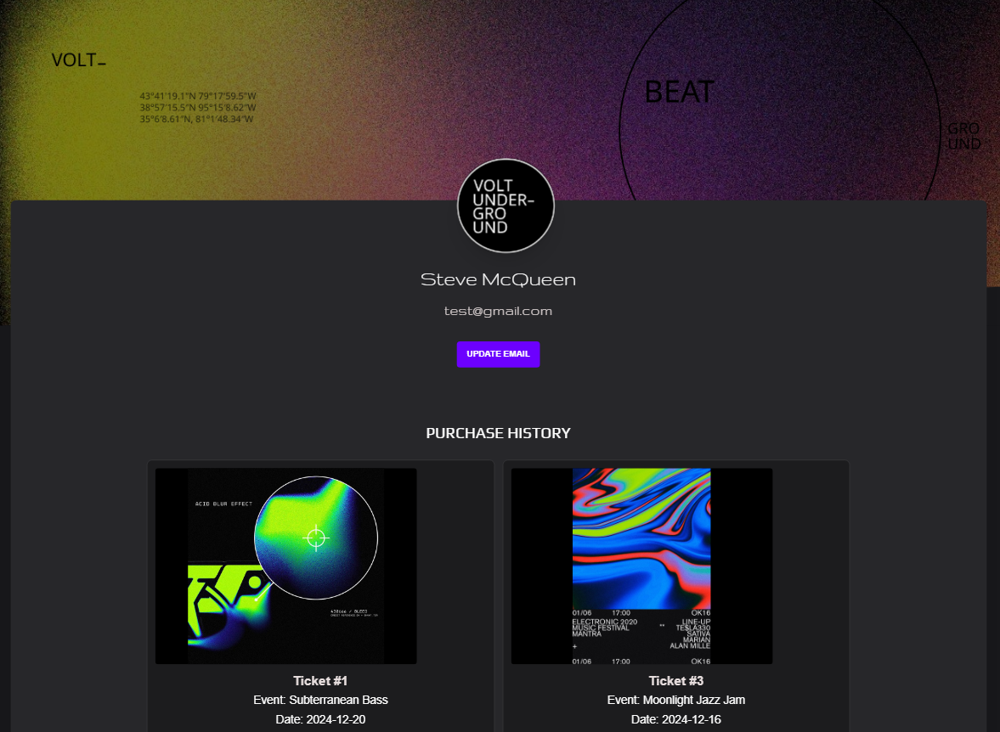
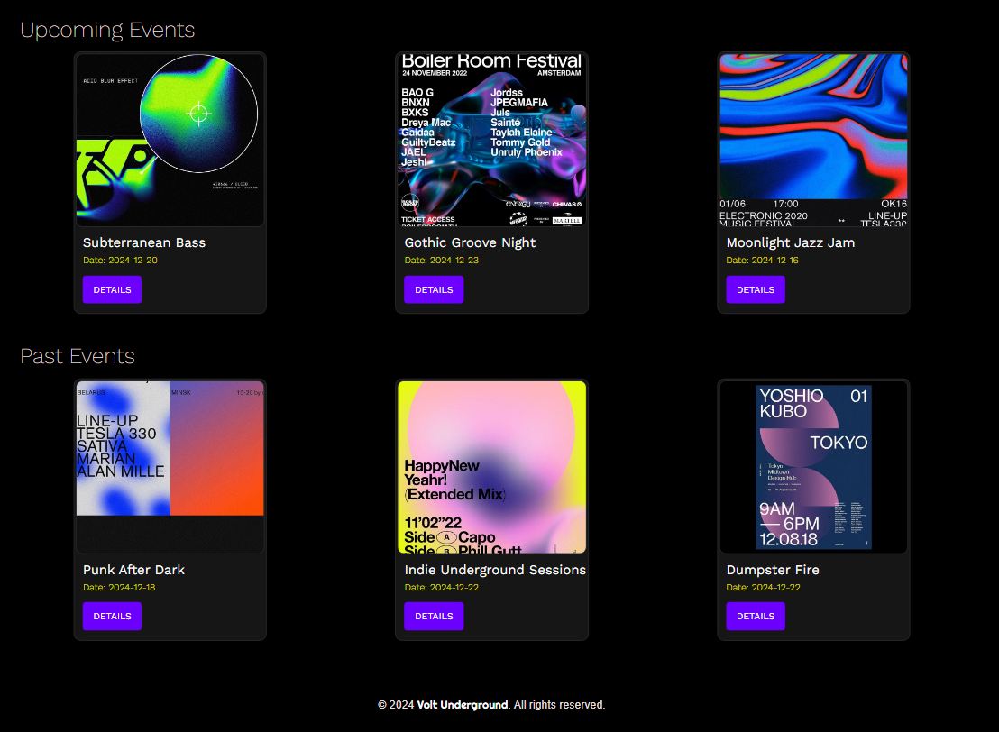
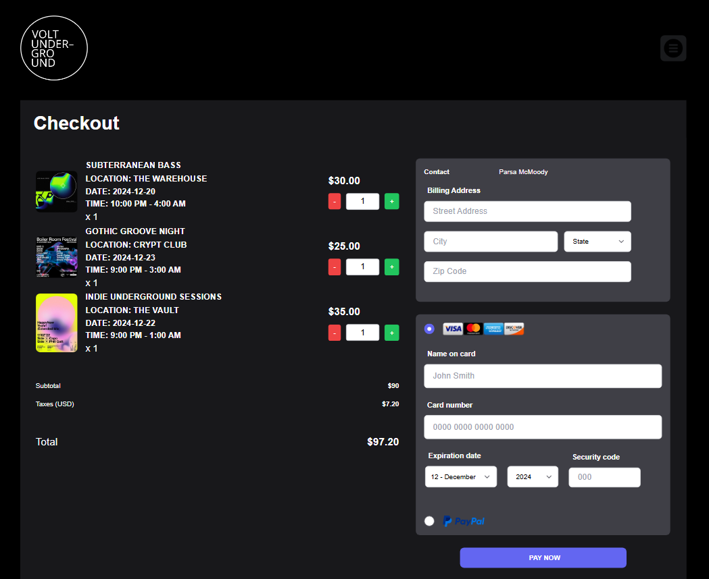

<div align="center">

  <!-- Add additional badges using the following format: -->
  <!-- (urlToGithubHere) -->

[](https://opensource.org/licenses/MIT)
[](https://github.com/parsamh8/Volt-Underground/graphs/contributors)
[](https://github.com/parsamh8/Volt-Underground/forks)
[](https://github.com/parsamh8/Volt-Underground/stargazers)
[](https://github.com/parsamh8/Volt-Underground/issues)

</div>

<!-- PROJECT LOGO -->

<div align="center">
  <a href="https://github.com/404pandas/project-2-setup-guide">
  <!-- TODO: Correct this file path to a logo if you would like one; otherwise, delete this a href -->
    
  </a>

<!-- TODO: Edit App name -->
  <h3 align="center">Volt Underground</h3>

  <p align="center">
  <!-- TODO: Edit App description -->
    Volt Underground is a dynamic ticket-selling platform designed for the underground DJ music scene. Users can create and manage their own profile pages, where they can keep track of their past ticket purchases and event participation. The app offers an intuitive interface for browsing upcoming events, enabling users to discover the latest DJ performances and easily purchase tickets for their favorite shows. Whether you're a devoted music lover or a first-time attendee, Volt Underground brings you closer to the heart of the underground music scene with ease and convenience.
    <br />
    <br />
    <!-- TODO: add deployment link -->
    <a href="https://volt-underground.onrender.com/">View Demo</a>
    ·
    <a href="https://github.com/parsamh8/Volt-Underground/issues">Report Bug</a>
    ·
    <a href="https://github.com/parsamh8/Volt-Underground/issues">Request Feature</a>

  </p>
</div>

<!-- TABLE OF CONTENTS -->
<details>
  <summary>Table of Contents</summary>
  <ol>
    <li>
      <a href="#about-the-project">About The Project</a>
      <ul>
        <li><a href="#built-with">Built With</a></li>
      </ul>
    </li>
    <li>
      <a href="#getting-started">Getting Started</a>
      <ul>
        <li><a href="#installation">Installation</a></li>
      </ul>
    </li>
    <li><a href="#usage">Usage</a></li>
    <li><a href="#roadmap">Roadmap</a></li>
    <li><a href="#contributing">Contributing</a></li>
    <li><a href="#license">License</a></li>
    <li><a href="#contact">Contact</a></li>
    <li><a href="#acknowledgments">Acknowledgments</a></li>
  </ol>
</details>


## About The Project

This project was built using Node.js, Express, React, MongoDB, Mongoose, and GraphQL.

### Built With

<div align="center">

<!-- TODO: Add any additional badges as needed. For more info, visit: https://github.com/404pandas/empty-resources/blob/main/assets/images/shields.md -->

[](https://www.typescriptlang.org/)
[](https://javascript.info/)
[](https://developer.mozilla.org/en-US/docs/Web/CSS)
[](https://nodejs.org/en/)
[](https://expressjs.com/)
[](https://www.npmjs.com/)
[](https://www.npmjs.com/package/bcrypt)
[](https://code.visualstudio.com/docs)
[](https://www.mongodb.com/docs/)
[](https://mongoosejs.com/)
[](https://graphql.org/)
[](https://www.npmjs.com/package/dotenv)
[](https://www.npmjs.com/package/nodemon)
[](https://jwt.io/)

</div>

<!-- GETTING STARTED -->

## Getting Started

This application will function as a deployed app on Render.
https://volt-underground.onrender.com/

### Local Installation / Testing

1. Clone the rep

```
git clone https://github.com/parsamh8/volt-underground
```

2. Install dependencies

```
npm i
```

3. Create the build directory

```
npm run build
```

4. Seed the database

```
npm run seed
```
5. Run in production mode

```
npm run start
```

5. Visit app:

[http://localhost:3001/](http://localhost:3001/)

<!-- Usage -->

## Usage

Volt Underground is a ticket-selling platform focused on the underground DJ music scene. Once a user creates an account, they gain access to a personalized profile page, where they can track their ticket purchases and browse upcoming events. The app features several key functionalities:




1. **User Profiles**: Each user has their own profile page where they can view their purchase history and keep track of past events. The profile page serves as a personalized hub for users to stay connected to their favorite events and DJ performances.
   


2. **Event Browsing**: Users can easily browse a wide range of upcoming underground DJ events through the app’s intuitive interface. The events feature a location, date, and genre, making it simple to discover new shows in your area.



3. **Ticket Purchases**: The app allows users to purchase tickets for their favorite events directly through the platform. With a streamlined purchasing process, Volt Underground ensures that users can secure their tickets with ease and confidence.



4. **GraphQL Integration**: Volt Underground uses GraphQL for efficient data fetching, allowing the app to serve personalized content like event recommendations and ticket availability in real-time. This improves user experience by delivering only the data they need.

Volt Underground aims to provide a seamless experience for users to discover underground music events, purchase tickets, and track their participation, all while offering a simple and engaging interface.


<!-- ROADMAP -->

## Roadmap

<!-- TODO: Plan out rough roadmap here -->

#### MVP

<!-- This is a nested check-box that displays a nice checked or unchecked list on your Github repo to show your visitor's a quick road map! -->

- [ ] **Front End**
  - [ ] User Auth
  - [ ] User Profile Page
    - [ ] Routing
    - [ ] Styling
  - [ ] Event Browsing Page
    - [ ] Event Details Display
  - [ ] Ticket Purchase Flow
    - [ ] Routing
    - [ ] Styling
  - [ ] Landing Page
    - [ ] Routing
    - [ ] Styling

- [ ] **Back End**
  - [ ] User Auth
  - [ ] Models
    - [ ] User Model
    - [ ] Event Model
    - [ ] Ticket Model
  - [ ] Seeds
  - [ ] API Routing
    - [ ] User Routes
    - [ ] Event Routes
    - [ ] Ticket Routes
  - [ ] GraphQL Integration

#### Future Development

- [ ] Add a **Search Functionality** to allow users to search for events by artist, venue, or genre.
- [ ] Create a **Dynamic Event Calendar** for users to easily browse events by date and location.
- [ ] Integrate a **Payment System** for ticket purchases (e.g., Stripe or PayPal).
- [ ] Implement **Event Recommendations** based on user preferences and past ticket purchases.
- [ ] Enable **Real-time Ticket Availability** to update users on the status of tickets for events.
- [ ] Add **User Reviews and Ratings** for events, artists, and venues.
- [ ] Expand the **Database** to support a larger user base and more event data.
- [ ] Integrate **Push Notifications** to alert users about upcoming events and ticket availability.

See the [open issues](https://github.com/parsamh8/Volt-Underground/issues) for a full list of proposed features (and known issues).

<!-- CONTRIBUTING -->

## Contributing

Contributions are what make the open source community such an amazing place to learn, inspire, and create. Any contributions you make are **greatly appreciated**.

If you have a suggestion that would make this better, please fork the repo and create a pull request. You can also simply open an issue with the tag "enhancement".
Don't forget to give the project a star! Thanks again!


## License

This project is licensed under the MIT license.


## Contributors

Join us in bringing the underground music scene to life! 🎧

[Parsa McMoody](https://github.com/parsamh8)

[Jake Magri](https://github.com/jake-magri)

[Brendan Murfield](https://github.com/bmurfield)
